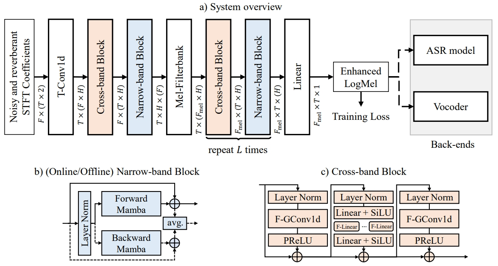
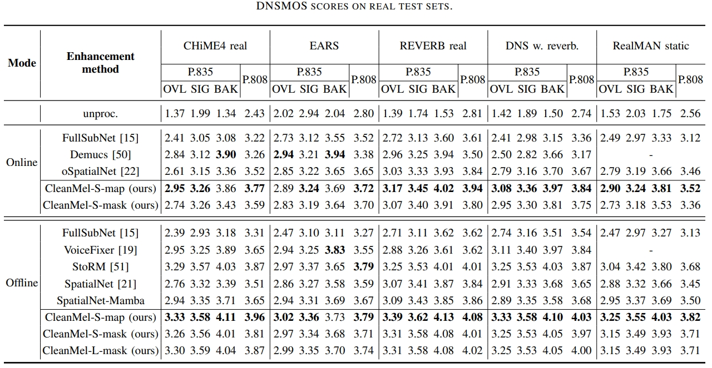
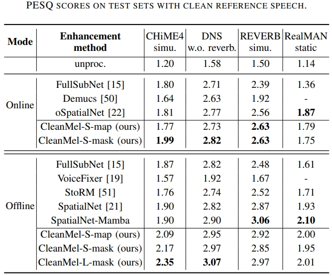
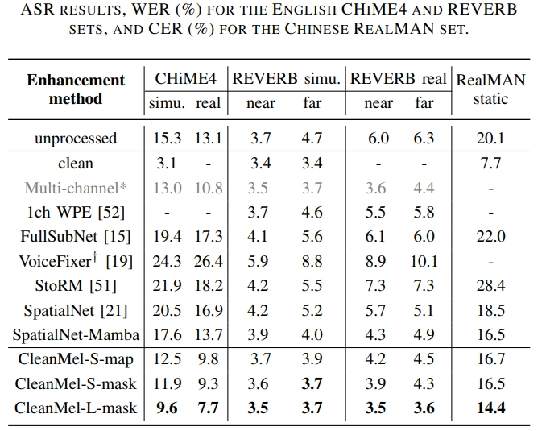

# CleanMel
[](https://arxiv.org/abs/2502.20040)
[](https://audio.westlake.edu.cn/Research/CleanMel.html)
[](https://huggingface.co/spaces/SaoYear/CleanMel)
[](https://github.com/Audio-WestlakeU/CleanMel/issues)
[](https://saoyear.github.io)

PyTorch implementation of "CleanMel: Mel-Spectrogram Enhancement for Improving Both Speech Quality and ASR" (accepted by IEEE Trans. ASLPRO, 2025).

## Notice 📢
- The CleanMel model checkpoints are now available on huggingface, the inference can be done using one-line commands.
- All models are available in `pretrained/enhancement/` folder.
- The enhanced results from 4 `offline_CleanMel_S/L_mask/map` models for the CHIME example `noisy_CHIME-real_F05_442C020S_STR_REAL` are given in `src/inference_example/pretrained_example_output` folder.

## Overview 🚀
<p align="center"></p>

**CleanMel** enhances logMel spectrograms for improved speech quality and ASR performance. Outputs compatible with:
- 🎙️ Vocoders for enhanced waveforms
- 🤖 ASR systems for transcription

## Demo Page 🎤
The demo page of CleanMel is published on [Hugging Face Spaces](https://huggingface.co/spaces/SaoYear/CleanMel).

If you downloaded the pretrained models (follwing [instructions](https://github.com/Audio-WestlakeU/CleanMel/tree/main/pretrained)), you can also activate this demo page locally by running the following command:
```bash
python app.py
```
Then, open your browser and visit `http://localhost:7860` to access the demo page.

## Quick Start ⚡

### Environment Setup
```bash
conda create -n CleanMel python=3.10.14
conda activate CleanMel
pip install -r requirements.txt
```

### Inference
Pretrained models can be downloaded manually [here](https://huggingface.co/WestlakeAudioLab/CleanMel), or automatically with the help of `huggingface-hub` package.

```bash 
# Inference with pretrained models from huggingface
## Offline example (offline_CleanMel_S_mask)
cd shell
bash inference.sh 0, offline S mask huggingface

## Online example (online_CleanMel_S_map)
bash inference.sh 0, online S map huggingface

# Inference with local pretrained models
cd shell
bash inference.sh 0, offline S mask

## Online example (online_CleanMel_S_map)
bash inference.sh 0, online S map
```
**Custom Input**: Modify `speech_folder` in `inference.sh`

**Output**: Results saved to `output_folder` (default to `./my_output`)

### Training
```bash
# Offline training example (offline_CleanMel_S_mask)
cd shell
bash train.sh 0,1,2,3 offline S mask
```
Configure datasets in `./config/dataset/train.yaml`

Default 4 GPUs trained with batch size 32

## Pretrained Models 🧠
```bash
pretrained/
├── enhancement/
│   ├── offline_CleanMel_S_map.ckpt
│   ├── offline_CleanMel_S_mask.ckpt
│   ├── online_CleanMel_S_map.ckpt
|   └── ...
└── vocos/
    ├── vocos_offline.pt
    └── vocos_online.pt
```
**Enhancement**: `offline_CleanMel_S/L_mask/map.ckpt` are available.

**Vocos**: `vocos_offline.pt` and `vocos_online.pt` are [here](https://drive.google.com/file/d/13Q0995DmOLMQWP-8MkUUV9bJtUywBzCy/view?usp=drive_link).

## Performance 📊
### Speech Enhancement
<p align="center"></p>
<p align="center"></p>

### ASR Accuracy
<p align="center"></p>

💡 ASR implementation details in [`asr_infer` branch](https://github.com/Audio-WestlakeU/CleanMel/tree/asr_infer)

## Citation 📝
```bibtex
@misc{shao2025cleanmel,
    title={CleanMel: Mel-Spectrogram Enhancement for Improving Both Speech Quality and ASR}, 
    author={Nian Shao and Rui Zhou and Pengyu Wang and Xian Li and Ying Fang and Yujie Yang and Xiaofei Li},
    year={2025},
    eprint={2502.20040},
    archivePrefix={arXiv},
    primaryClass={eess.AS},
    url={https://arxiv.org/abs/2502.20040}
}
```

## Acknowledgement 🙏
- Built using [NBSS](https://github.com/Audio-WestlakeU/NBSS) template
- Vocoder implementation from [Vocos](https://github.com/gemelo-ai/vocos)
